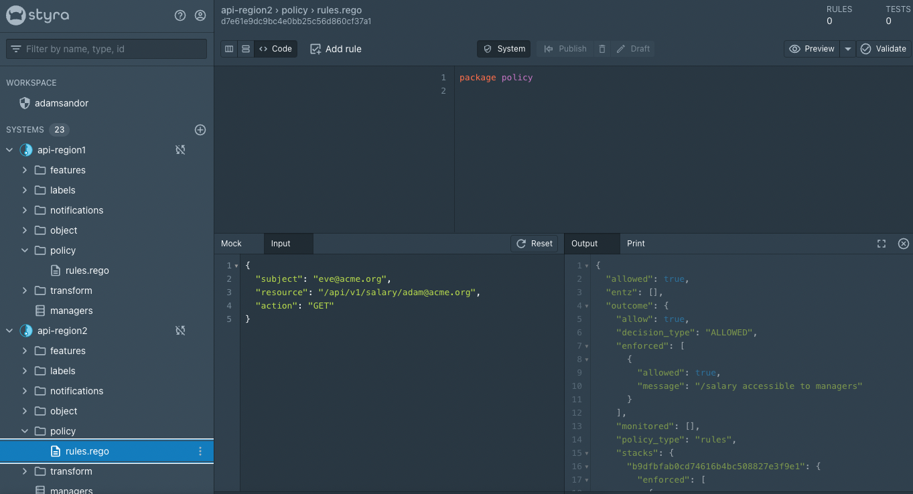

# Entitlements Stacks Demo

This demo setup shows how the Entitlements system type can use Stacks to implement both central and specific policies
that authorize API access.

Note that this demo requires a [Styra DAS](https://www.styra.com/styra-das/) tenant. You can request one at https://signup.styra.com.

## Organizing Policies into Stacks and Systems

This demo contains two Systems. Each System contains the policies applied to a regional API:
* api-region1
* api-region2

The goal is for both regions to have mostly similar policies but allow for deviations. `api-region2` doesn't specify any
region-specific policies while api-region1 does. 
Both systems inherit policies from the Stack `api-master-policies`. All policies defined in the Stack are applied to both
Systems. For this to work the Systems have to define a policy called `enforce` in the `policy` package.

The policies in the `api-master-policies` Stack reference a dataset called `managers`. This dataset isn't defined in the
Stack but in each regional System. Each region is expected to have a different set of managers.

## Installation

1. Create a file called .env in the root folder. Define the following variables in it:
```shell
DAS_TENANT=<YOUR STYRA DAS URL>
API_TOKEN=<YOUR API TOKEN>
```
See [this page](https://docs.styra.com/administration/token-management/create-api-token) on how to create an API token.

2. Run `./setup-das-systems-stack.sh` to create the two systems and the stack

## Play with the demo

You can either run local OPA(s) where you deploy the demo System(s) or you can play with the sample inputs straight in
Styra DAS using the Preview functionality.

Here are some sample inputs you can try. You can paste these straight into the input box in Styra DAS or use them as the
payload in requests to OPA (see example request further down).



### Sample 1
```json
{
  "subject": "jane@styra.com",
  "resource": "/api/v1/managers",
  "action": "GET"
}
```
This will produce a policy violation as jane@styra.com isn't an acme.org employee.

### Sample 2
```json
{
  "subject": "region1-admin@acme.org",
  "resource": "/api/v1/managers",
  "action": "GET"
}
```
This request will be allowed in api-region1 but denied in api-region2 because of the special policy in api-region1 rules.rego.

### Sample 3
```json
{
  "subject": "eve@acme.org",
  "resource": "/api/v1/salary/adam@acme.org",
  "action": "GET"
}
```
This will be allowed in System api-region2 because Eve is listed as a manager there (see datasource `managers`), but will
be denied in api-region1 as the list of managers is different there. The policy itself is defined on the Stack level but
the data is region specific.

### Testing with OPA

To test the policies in a running OPA instance you have to download the configuration from Styra DAS for either the api-region1
or api-region2 Systems. This can be found under System/Settings/Install/OPA CLI. You can find the exact commands to download
the configuration and run OPA with it.

When testing the above inputs with a running OPA make sure to put the input under the `input` key in the payload and
use the `/main/main` path for the policy:

```shell
curl -X POST localhost:8181/v1/data/main/main -d '{
  "input":{
    "subject":"adam@styra.com",
    "resource": "/api/v1/salary/adam@acme.org",
    "action": "GET"}
  }' 
```
